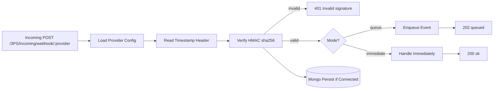

# rcp-webhook-receiver


Lightweight TypeScript + Fastify boilerplate for receiving, verifying, and processing third-party webhooks.

## Why This Boilerplate

- Fast webhook intake with raw-body signature verification
- Provider-based config through environment variables
- Immediate or queued processing mode
- Optional MongoDB persistence
- Simple test setup with Tap

## Request Flow



## Features

- TypeScript source with compiled output in `dist/`
- Fastify server with rate limiting
- HMAC (`sha256`) signature validation using raw body
- Provider-specific header/secret configuration
- Queue or immediate processing per request
- Mongo persistence when available
- Health route + webhook route + test coverage

## Tech Stack

- Node.js
- TypeScript
- Fastify
- Mongoose
- Tap

## Project Structure

```text
src/
	models/
		incomingWebhooks.ts
	plugins/
		hmac.ts
		mongoose.ts
	routes/
		webhook.ts
	types/
		fastify.d.ts
	queue.ts
	server.ts
test/
	hmac.test.ts
	webhook.test.ts
```

## Quick Start

- Node.js 18+
- npm

Install:

```bash
npm install
```

Configure:

- copy `.env.example` to `.env`
- set `MONGODB_URI` (or set `SKIP_MONGODB=true`)

Run in dev:

```bash
npm run dev
```

Build + run compiled:

```bash
npm run build
npm start
```

Test:

```bash
npm test
```

## Environment

Core:

- `HOST` (default: `0.0.0.0`)
- `PORT` (default: `3000`)
- `MONGODB_URI` (required unless `SKIP_MONGODB=true`)
- `RATE_LIMIT_MAX` (default: `100`)
- `RATE_LIMIT_WINDOW` (default: `60000` ms)
- `SKIP_MONGODB` (`true` to skip Mongo connection)

Per provider (`<PROVIDER>` is uppercase):

- `WEBHOOK_SECRET_<PROVIDER>`
- `WEBHOOK_HEADER_<PROVIDER>` (default: `x-hub-signature-256`)
- `WEBHOOK_HEADER_TIMESTAMP_<PROVIDER>` (default: `x-hub-timestamp`)
- `WEBHOOK_MODE_<PROVIDER>` (`immediate` or `queue`)

Example (`stripe`):

- `WEBHOOK_SECRET_STRIPE`
- `WEBHOOK_HEADER_STRIPE=x-stripe-signature`
- `WEBHOOK_HEADER_TIMESTAMP_STRIPE=x-stripe-timestamp`
- `WEBHOOK_MODE_STRIPE=queue`

## Routes

- `GET /3PS/incoming/webhook/health`
- `POST /3PS/incoming/webhook/:provider`

Webhook responses:

- `400` unknown provider or missing timestamp
- `401` invalid signature
- `202` queued mode
- `200` immediate mode

Query override:

- `?mode=queue`
- `?mode=immediate`

## Note

Use `npm run dev` for TypeScript runtime. Do not run `node src/server.ts` directly.
